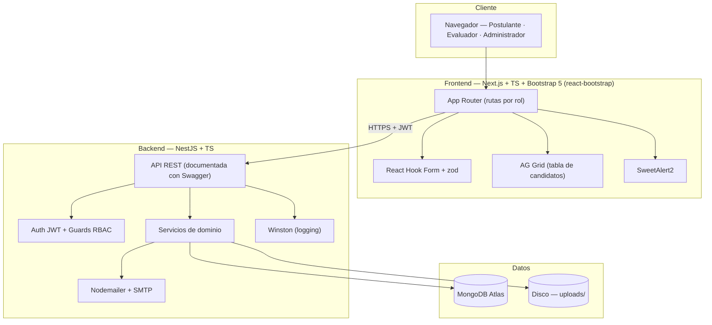
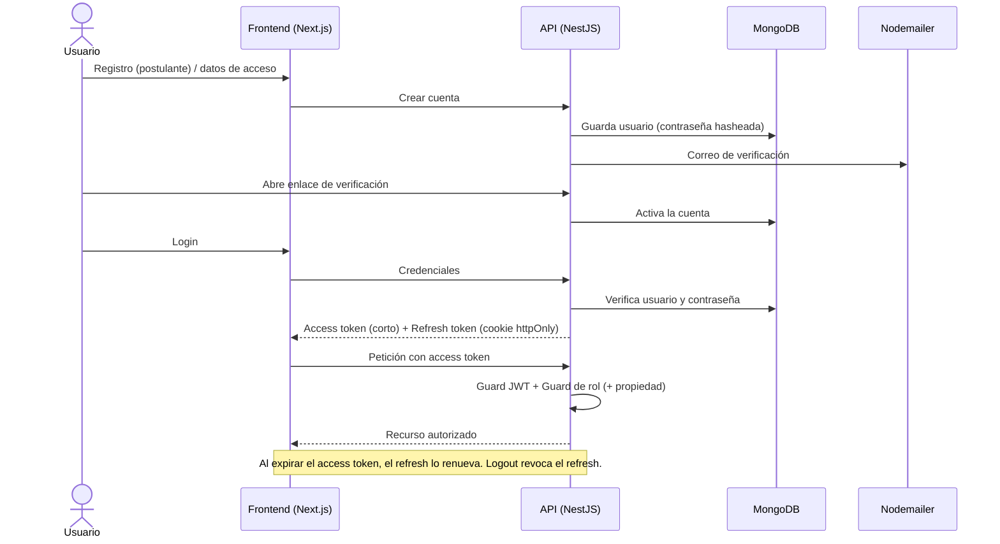
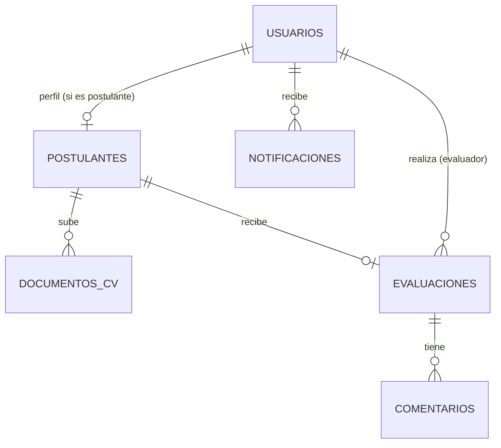

# ASOMMMN — Arquitectura del Sistema (V1: Evaluación Curricular)

**Alcance de esta versión (V1):** los postulantes se registran, inician sesión y suben su CV; los evaluadores revisan, califican y comentan; los administradores gestionan usuarios, evaluaciones y reportes. **Sin IA en V1** (la capa de análisis con IA se incorpora en una fase posterior; la arquitectura ya queda preparada para ello).

> Este documento es de diseño, no de implementación. Reemplaza, para el build de V1, a la especificación del sistema completo con IA (que queda como plano de referencia para la fase de IA futura).

---

## 0. Stack recomendado y por qué

**Frontend**
- **Next.js + TypeScript** — base del frontend.
- **Bootstrap 5 vía `react-bootstrap`** + **Bootstrap Icons** — componentes listos y consistentes, idiomáticos en React (sin el JS clásico de Bootstrap).
- **React Hook Form + zod** — formularios con validación declarativa; las reglas de zod se comparten con el backend para validar igual en ambos lados.
- **AG Grid (Community)** — tabla de candidatos con orden, filtro y paginación; la edición gratuita sobra para V1.
- **SweetAlert2** — confirmaciones y avisos (aprobar/rechazar, eliminar, etc.).

**Backend**
- **NestJS + TypeScript** — API modular en capas.
- **JWT** — autenticación (access token corto + refresh rotatorio).
- **Nodemailer** — envío de correo; detrás, un proveedor SMTP real para entregabilidad.
- **Winston** — logging estructurado.
- **Swagger (`@nestjs/swagger`)** — documentación viva de la API.

**Datos**
- **MongoDB Atlas + Mongoose** — base de datos.
- **Disco del servidor** — almacenamiento de CVs, certificados y archivos de evaluadores en `uploads/` (configurable con `STORAGE_PATH`); servidos vía `express.static`.

**DevOps / herramientas**
- **Git + GitHub** — control de versiones.
- **Postman** — pruebas manuales de la API.
- **Swagger UI** — contrato y pruebas de endpoints.
- **Sin Docker** por ahora (consistente con el resto del proyecto).

**Lo que se deja fuera de V1 (entra con la IA):** OpenAI, Redis + cola de trabajos, extracción de certificados, cédula de contacto, cursos obligatorios y los reportes con datos extraídos por IA.

---

## 1. Arquitectura completa del sistema

Cliente-servidor desacoplado: Next.js consume una API REST de NestJS; los datos viven en MongoDB Atlas y los archivos en MinIO. Sin procesamiento asíncrono (no hay IA en V1), así que no se necesita Redis.



**Principios:**
- Los archivos (CVs, certificados, archivos de evaluadores) se guardan en disco (`uploads/`) y se sirven como archivos estáticos vía `express.static`. No hay URLs prefirmadas; el acceso está protegido por los guards del backend.
- El control de acceso real vive en el backend (guards); el frontend solo oculta o muestra UI.
- API documentada con Swagger desde el inicio (sirve de contrato para el frontend y de banco de pruebas).
- Arquitectura modular: la IA (Fase 6, módulo `ingest-ia`) y el panel de archivos del evaluador (`eval-archivos`) se añadieron sin tocar los módulos core.
- **Entornos:** desarrollo y producción, cada uno con su base Atlas; `STORAGE_PATH` y `BACKEND_PUBLIC_URL` configurables por variables de entorno.

---

## 2. Estructura de carpetas del frontend (Next.js)

```
apps/web/
├─ src/
│  ├─ app/
│  │  ├─ (auth)/
│  │  │  ├─ login/
│  │  │  ├─ registro/
│  │  │  └─ recuperar-contrasena/
│  │  ├─ (postulante)/
│  │  │  ├─ dashboard/
│  │  │  ├─ mi-perfil/
│  │  │  ├─ mi-cv/
│  │  │  └─ estado/
│  │  ├─ (evaluador)/
│  │  │  ├─ candidatos/            # tabla AG Grid
│  │  │  ├─ candidato/[id]/        # ver CV + calificar + comentar + panel IA
│  │  │  └─ archivos/[postulanteId]/ # panel de archivos tipo nube (Fase 6.5)
│  │  ├─ (admin)/
│  │  │  ├─ usuarios/
│  │  │  ├─ evaluaciones/
│  │  │  └─ reportes/
│  │  ├─ layout.tsx                # layout raíz
│  │  └─ page.tsx                  # landing / redirección por rol
│  ├─ components/
│  │  ├─ ui/                       # botones, inputs, modales (react-bootstrap)
│  │  ├─ forms/                    # formularios con RHF + zod
│  │  ├─ tables/                   # configuración de AG Grid
│  │  └─ layout/                   # navbar, sidebar por rol
│  ├─ lib/
│  │  ├─ api/                      # cliente HTTP hacia la API
│  │  ├─ auth/                     # sesión, manejo de tokens
│  │  └─ validators/               # esquemas zod (compartidos con backend)
│  ├─ hooks/
│  ├─ types/
│  └─ styles/                      # estilos globales + variables Bootstrap
├─ public/
└─ middleware.ts                   # protección de rutas y redirección por rol
```

Cada grupo de rutas `(rol)` tiene su propio layout (navegación distinta) y queda protegido por el `middleware`, que valida sesión y rol antes de renderizar.

---

## 3. Estructura de carpetas del backend (NestJS)

```
apps/api/
├─ src/
│  ├─ modules/
│  │  ├─ auth/                     # registro, login, JWT, recuperación, MFA opc.
│  │  ├─ usuarios/                 # CRUD de usuarios y roles
│  │  ├─ postulantes/              # perfil del postulante
│  │  ├─ documentos/               # CV: subida, versión, disco
│  │  ├─ evaluaciones/             # calificación + estado de la evaluación
│  │  ├─ comentarios/              # observaciones del evaluador
│  │  ├─ reportes/                 # generación/exportación de reportes
│  │  ├─ notificaciones/           # correo (Nodemailer) + registro
│  │  ├─ storage/                  # StorageService: disco (STORAGE_PATH)
│  │  ├─ ingest-ia/               # extracción IA de CVs con OpenAI (Fase 6)
│  │  └─ eval-archivos/            # panel de archivos del evaluador (Fase 6.5)
│  ├─ common/
│  │  ├─ guards/                   # JwtGuard, RolesGuard, OwnershipGuard
│  │  ├─ decorators/               # @Roles(), @CurrentUser()
│  │  ├─ filters/                  # filtro global de excepciones
│  │  ├─ interceptors/             # logging/auditoría
│  │  └─ pipes/                    # validación
│  ├─ config/                      # carga y validación de variables de entorno
│  ├─ app.module.ts
│  └─ main.ts                      # arranque + Swagger + helmet + CORS
└─ test/
```

---

## 4. Módulos del sistema

| Módulo | Responsabilidad |
|---|---|
| `auth` | Registro, verificación de correo, login, recuperación, emisión/rotación de JWT, guards. |
| `usuarios` | Gestión de los tres tipos de usuario; alta de evaluadores/admins; activar/bloquear. |
| `postulantes` | Perfil del postulante (datos básicos) y su estado en el proceso. |
| `documentos` | Subida del CV (PDF), validación de archivo, versionado, vínculo con MinIO. |
| `evaluaciones` | Crear/actualizar la evaluación de un postulante: calificación y estado (en revisión, evaluado, etc.). |
| `comentarios` | Observaciones del evaluador sobre un postulante/CV. |
| `reportes` | Generar y exportar reportes (lista de candidatos con calificación y estado; ficha individual). |
| `notificaciones` | Correo con Nodemailer (verificación, resultado, solicitudes) + registro en BD. |
| `storage` | Envoltura de MinIO: subir, generar URLs prefirmadas, organizar carpetas. |
| `common` / `config` | Guards, decoradores, filtros, interceptores de logging y validación de configuración. |

> Cuando se incorpore la IA, se añade un módulo `ingesta-ia` + un proceso *worker*; el resto no cambia.

---

## 5. Roles y permisos

Tres roles con RBAC (control de acceso por rol). El control se aplica en el backend mediante guards.

| Capacidad | Postulante | Evaluador | Administrador |
|---|:--:|:--:|:--:|
| Registrarse / iniciar sesión | ✅ | ✅ | ✅ |
| Completar su perfil y subir su CV | ✅ | — | — |
| Ver su propio estado y comentarios recibidos | ✅ | — | — |
| Ver lista de postulantes | — | ✅ | ✅ |
| Ver el CV de un postulante | — | ✅ | ✅ |
| Calificar y comentar | — | ✅ | ✅ |
| Cambiar estado de una evaluación | — | ✅ | ✅ |
| Generar/exportar reportes | — | ✅ | ✅ |
| Crear evaluadores y administradores | — | — | ✅ |
| Gestionar usuarios (activar/bloquear) | — | — | ✅ |
| Configuración general del sistema | — | — | ✅ |

**Regla de propiedad:** un postulante solo accede a *su* perfil, *su* CV y *sus* comentarios; nunca a los de otros. Esto lo verifica un guard de propiedad en cada endpoint con recurso identificado.

**Estados de la evaluación (propuesta V1):** `pendiente` → `en_revision` → (`informacion_solicitada` ↔ vuelve al postulante) → `evaluado` con resultado `aprobado` / `rechazado`. Cada cambio queda registrado con autor y fecha.

---

## 6. Flujo de autenticación

JWT con access token de vida corta + refresh token rotatorio en cookie `httpOnly`.



**Puntos clave:**
- Contraseñas con hash fuerte (argon2/bcrypt); verificación de correo antes de activar.
- Recuperación de contraseña por token de un solo uso con caducidad.
- Access token corto + refresh rotatorio almacenado para poder revocarlo (logout, bloqueo).
- Evaluadores y administradores los crea el administrador (no hay auto-registro para esos roles).
- *Rate limiting* y bloqueo por intentos fallidos en login/registro.
- (Opcional recomendado) MFA para evaluador/admin más adelante.

---

## 7. Modelo de base de datos MongoDB

Colecciones principales (los archivos PDF viven en MinIO; Mongo solo guarda metadatos).

**`usuarios`**

| Campo | Nota |
|---|---|
| `_id` | identificador |
| `email` | único, índice |
| `passwordHash` | argon2/bcrypt |
| `rol` | `postulante` · `evaluador` · `administrador` |
| `estadoCuenta` | `pendiente_verificacion` · `activa` · `bloqueada` |
| `emailVerificado` | booleano + fecha |
| `nombre`, `apellidos` | datos básicos |
| `creadoPor` | ref (para evaluadores/admins creados por el admin) |
| `creadoEn`, `ultimoAcceso` | metadatos |

**`postulantes`** (perfil del postulante; 1–1 con un usuario de rol postulante)

| Campo | Nota |
|---|---|
| `_id`, `usuarioId` (único, índice) | base |
| `telefono`, `domicilio` | contacto |
| `carrera`, `universidad` | formación |
| `experienciaLaboral` | texto/estructura breve |
| `estadoProceso` | espejo del estado de su evaluación |

**`documentos_cv`** (cada CV subido)

| Campo | Nota |
|---|---|
| `_id`, `postulanteId` (índice) | base |
| `version`, `esVigente` | permite re-subir conservando historial |
| `minio` | `{ bucket, key, hash, tamanio, mime }` |
| `subidoEn` | metadato |

**`evaluaciones`** (una por postulante; la revisión del evaluador)

| Campo | Nota |
|---|---|
| `_id`, `postulanteId` (índice), `cvId` | base |
| `evaluadorId` | ref, índice |
| `estado` | `pendiente` · `en_revision` · `informacion_solicitada` · `evaluado` |
| `resultado` | `aprobado` · `rechazado` (cuando aplica) |
| `calificacion` | número/escala |
| `historialEstados` | array `{ estado, por, fecha }` |
| `creadoEn`, `actualizadoEn` | metadatos |

**`comentarios`**

| Campo | Nota |
|---|---|
| `_id`, `evaluacionId` (índice), `autorId` | base |
| `texto`, `tipo` (`comentario`/`solicitud`), `creadoEn` | contenido |

**`notificaciones`**

| Campo | Nota |
|---|---|
| `_id`, `destinatarioId` (índice), `tipo`, `titulo`, `cuerpo` | base |
| `canal` (`email`/`in_app`), `leida`, `creadoEn` | estado |

**`reportes_generados`** (metadatos; el PDF/Excel vive en MinIO)

| Campo | Nota |
|---|---|
| `_id`, `tipo`, `generadoPor`, `generadoEn`, `minio.key` | trazabilidad |

**Relaciones e índices**



- Índices: `usuarios.email` (único) y `usuarios.rol`; `postulantes.usuarioId` (único); `documentos_cv.postulanteId`; `evaluaciones.evaluadorId` y `evaluaciones.estado`; `comentarios.evaluacionId`.
- Listados siempre paginados y proyectados (no traer documentos completos en vistas de tabla).
- Modelo extensible: cuando entre la IA, se agregan colecciones `extracciones`/`items_capacitacion` sin alterar las actuales.

---

## 8. Roadmap de desarrollo por fases

| Fase | Nombre | Entregable verificable |
|---|---|---|
| 0 | Cimientos | Monorepo (web + api), conexión a Mongo Atlas y MinIO, Swagger, Winston, `/health` en verde. Sin Redis. |
| 1 | Identidad y acceso | Registro, verificación de correo, login, recuperación, RBAC de 3 roles, alta de evaluadores/admins. |
| 2 | Portal del postulante | Perfil + subida del CV a MinIO (validación de PDF, versionado), ver estado y comentarios. |
| 3 | Portal del evaluador | Lista de candidatos (AG Grid: buscar/filtrar/ordenar), ver CV, calificar, comentar, cambiar estado. |
| 4 | Portal del administrador | Gestión de usuarios, panel de evaluaciones y generación/exportación de reportes. |
| 5 | Notificaciones y endurecimiento | Correo con Nodemailer (verificación, resultado, solicitudes), auditoría básica, seguridad, accesibilidad. |
| 6 (futuro) | Capa de IA | Incorporar extracción con OpenAI (módulo + worker + Redis) reutilizando el diseño del sistema completo. |

Transversal: pruebas de la lógica crítica (estados, permisos), documentación Swagger al día y secretos fuera del repositorio.

---

## Cómo seguir con Claude Code

1. **Pausa el build actual:** Claude Code venía configurándose con la especificación del sistema completo (Tailwind + IA). Para V1, ese ya no es el plano.
2. **Usa este documento como nueva fuente de verdad** del V1: guárdalo en el repo como `docs/arquitectura-v1.md`. (La especificación completa con IA consérvala como `docs/sistema-completo-ia.md`, es el plano de la Fase 6 futura.)
3. Cuando quieras, te genero el **prompt de la Fase 0 ya adaptado a este stack** (Bootstrap/react-bootstrap, Swagger, Winston, sin Redis), y seguimos fase por fase como antes.

---

*Fin de la arquitectura V1 — ASOMMMN.*
